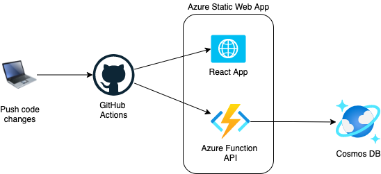
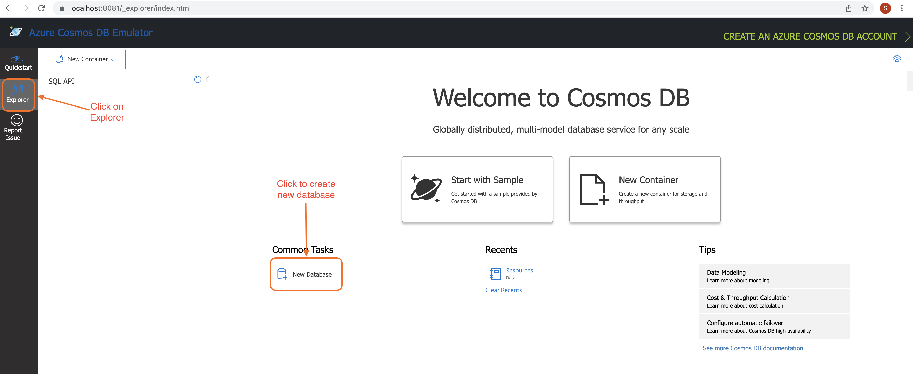
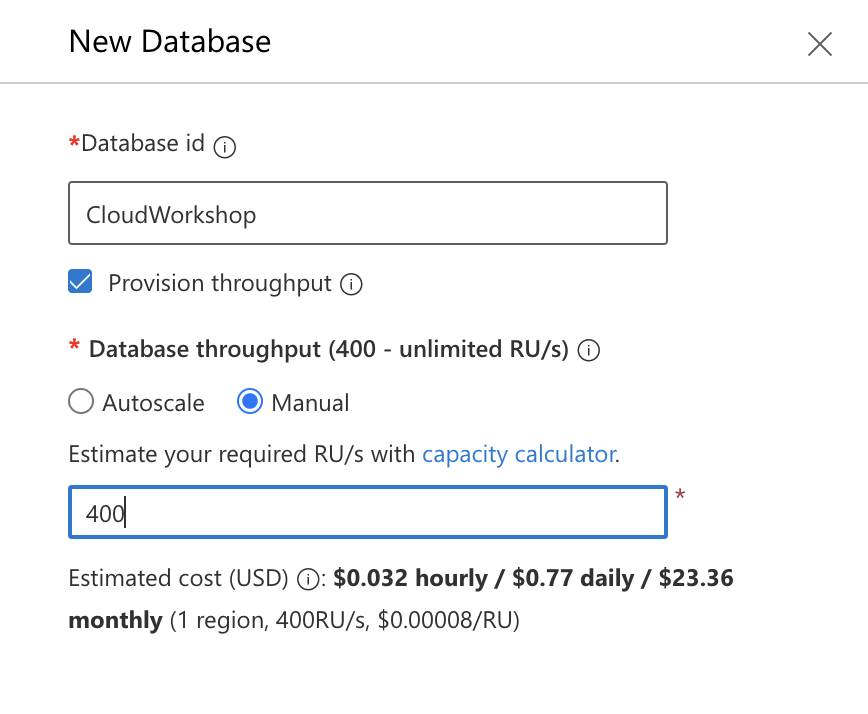
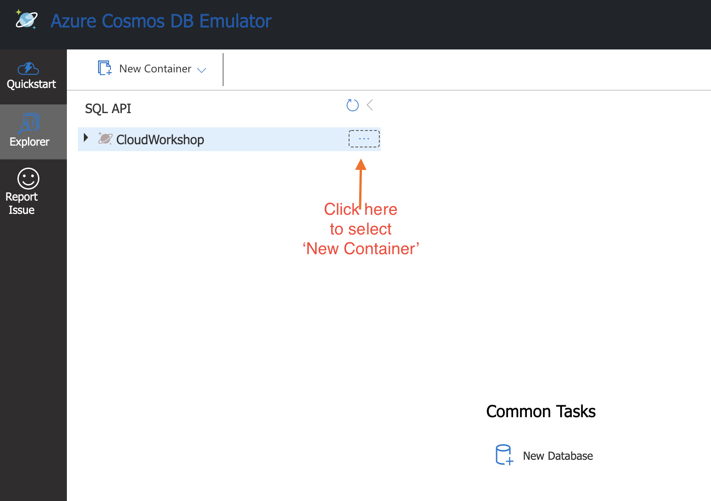
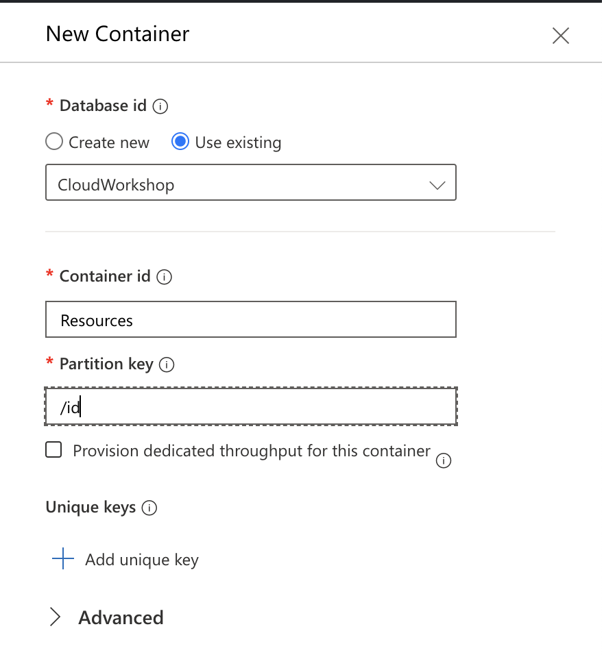
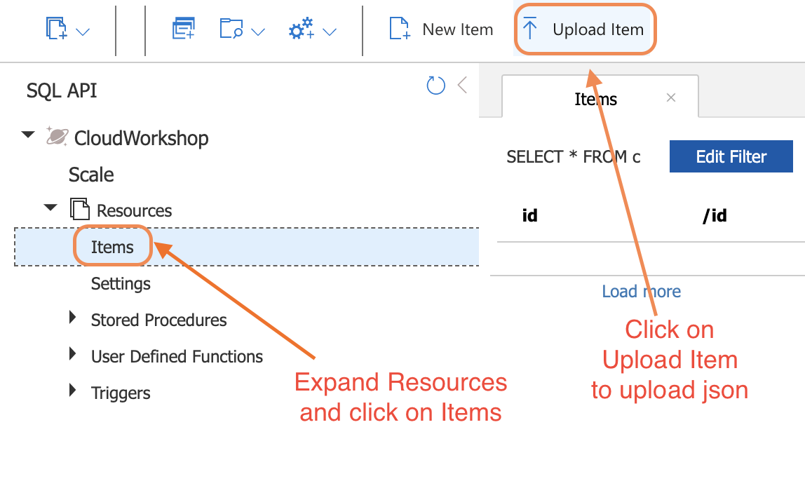
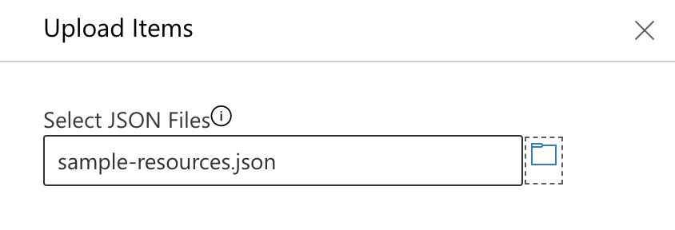
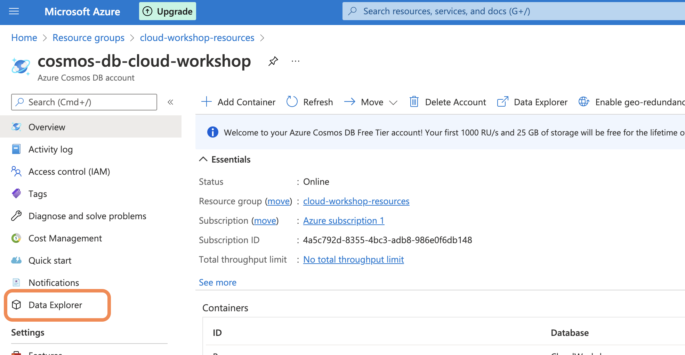
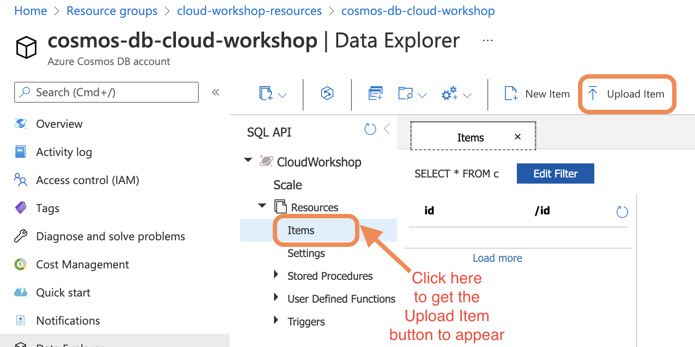

# Workshop to Deploy to Azure Static Web Apps

[](https://github.com/sunithapatel/cloud-workshop-serverless/actions/workflows/deploy.yaml)

This is a session in the **Let Your Code Fly High!** workshop series hosted in collaboration with Women Who Code [Frontend](https://www.womenwhocode.com/frontend) & [Cloud](https://www.womenwhocode.com/cloud) to showcase various ways to deploy a web application to the cloud.

## Sample Application Architecture

- Frontend - React (this was a Hacktoberfest project by WWC Frontend - https://github.com/frontendstudygroup/frontendstudygroup.github.io)
- Backend API - .NET 6 Azure Function
- Database - Cosmos DB



## Tools for local development

- [Visual Studio Code](https://code.visualstudio.com/)
    - Extensions:
        - [C#](https://marketplace.visualstudio.com/items?itemName=ms-dotnettools.csharp)
        - [Azure Functions](https://marketplace.visualstudio.com/items?itemName=ms-azuretools.vscode-azurefunctions)
- [.Net 6 SDK](https://dotnet.microsoft.com/en-us/download)
- [Azure Functions Core Tools](https://github.com/Azure/azure-functions-core-tools)
- [Nodejs](https://nodejs.org/en/)
- For local development 
    - [Azure Static Web Apps CLI](https://www.npmjs.com/package/@azure/static-web-apps-cli)
      - Install with command: `npm install -g @azure/static-web-apps-cli`
    - [Azure Cosmos Db Emulator](https://docs.microsoft.com/en-us/azure/cosmos-db/local-emulator?tabs=ssl-netstd21)

## Running the application on your local machine

It is possible to run the full application on your machine after you have installed the tools above and cloned this repository to your machine.

### Set up Azure Cosmos DB

For Windows you can download and install the emulator from [here](https://docs.microsoft.com/en-us/azure/cosmos-db/local-emulator?tabs=ssl-netstd21)

For Linux/MacOS, you can either use the above Windows tool in a Windows VM or use a Cosmos DB Emulator Docker image. [You can follow these instructions to get and run the Docker image](https://docs.microsoft.com/en-us/azure/cosmos-db/linux-emulator?tabs=ssl-netstd21).

Once the emulator is running, browse to https://localhost:8081/_explorer/index.html to interact with your local Cosmos DB database account.

### Populate data in Cosmos DB

In the Explorer view, create a database named 'CloudWorkshop'.



In the modal to create the database, give the name `CloudWorkshop` and set it to Manual throughput with 400 RUs. (This is similar to what we will do in Azure to keep it within the free tier).



In the CloudWorkshop database, click the ellipsis and select 'New Container'.



In the modal to create the container, give the name 'Resources' and the partition key as `/id`.



Expand the CloudWorkshop database and the Resources container and then click on Items to see the Upload Item on the top to select.



In the modal, browse to the folder `deployment` and then select `sample-resources.json`. Click Upload.



Close the modal and then collapse and expand the Resources container and click on Items. You should now see the 12 items from the json file.


### Set up local configuration for the Azure function

When running the Azure function locally, it reads configuration settings from a `local.settings.json` file that you will need to create when you set up this repo for the first time.

In the `api` folder, create a file named `local.settings.json` and put in the contents below:

```
{
  "IsEncrypted": false,
  "Values": {
    "AzureWebJobsStorage": "",
    "FUNCTIONS_WORKER_RUNTIME": "dotnet",

    "CosmosDbAccount": "https://localhost:8081/",
    "CosmosDbKey": "C2y6yDjf5/R+ob0N8A7Cgv30VRDJIWEHLM+4QDU5DE2nQ9nDuVTqobD4b8mGGyPMbIZnqyMsEcaGQy67XIw/Jw==",
    "CosmosDbDatabaseName": "CloudWorkshop",
    "CosmosDbContainerName": "Resources"
  }
}
```

This contains the information for the Azure function to connect to the local Cosmos DB emulator.

### Run the Static Web App locally

To execute the React App and Azure Function locally, you can use the [Azure Static Web Apps CLI](https://www.npmjs.com/package/@azure/static-web-apps-cli).

Install the CLI using the command below:
```
npm install -g @azure/static-web-apps-cli
```

To run the React App and the Azure function locally, make sure you are located at the root of the repository and run the command below:
```
swa start --app-location ./ui http://localhost:3000 --run "npm start" --api-location ./api
```

## Deployment to Azure

### Create resources

In the `deployment` folder there is a script that can be used to create a resource group with Azure Cosmos DB and Azure Static Webapp using ARM (Azure Resource Manager) templates.

Run the command below to execute the bash script:
> Before running the script you will need to run `az login` to login to your Azure account (this opens a browser where you pick your Azure account with your email).

```
cd deployment
bash azure-deployment.sh
```

After the above script succeeds, you should be able to login to the Azure portal and see the resource group `cloud-workshop-resources` that now has a Cosmos DB database and a Static Web App.

## Enable deployment to Azure from GitHub Actions

In order to be able to deploy the code using GitHub Actions, you will need to create a secret that is used in the workflow file under `.github/workflows` and populate it with a deployment token from the static web app.

You can do this manually using the Azure portal and GitHub UI. Or you can run the script below.

> You will need to install [GitHub CLI](https://cli.github.com/) first to be able to run this script.

```
bash link-to-github-repo.sh
```

### Populate data in Azure Cosmos DB

The steps here are very similar to what was done in the local emulator.

Go to the Cosmos DB resource and click on Data Explorer in the sidebar.



You should already see CloudWorkshop database. Expand that and you will see the Resources container. (These were created as part of the deployment script in the previous step). Click on Items and then click on Upload Item.



In the modal, click to Browse, select the `deployment` folder and then select the `sample-resources.json` within it and click Upload.

It will show you that it created 12 items. Close the modal and then close the Items window and click Resources and Items again to see the created items.

### Deploy code to Azure with GitHub Actions

Now you are ready to deploy the code to the static web app. You can go to the GitHub action and trigger the workflow. 

Whenever you push any code changes to the main branch of the repository or make and close a pull request to your repository, that will also trigger the GitHub action and deploy it to the static web app.
